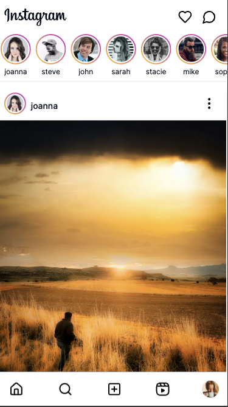
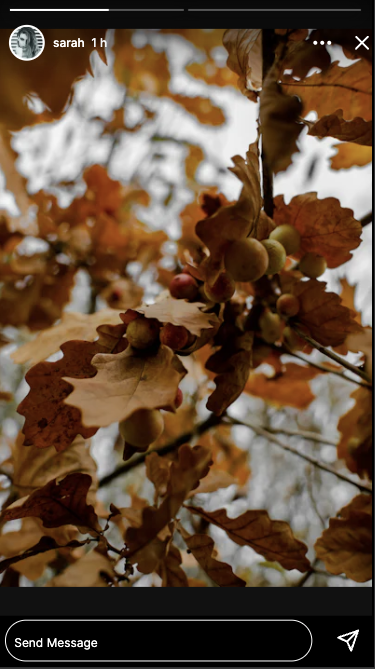

# Instagram Stories Clone


A frontend clone of the Instagram Stories feature, built using Next.js, Shadcn UI components, and Tailwind CSS.

## Table of Contents

-   [Features](#features)
-   [Demo](#demo)
-   [Technology Stack](#technology-stack)
-   [Installation](#installation)
-   [Running the Development Server](#running-the-development-server)
-   [Testing](#testing)
-   [Deployment](#deployment)
-   [Continuous Integration & Deployment (CI/CD)](#continuous-integration--deployment-cicd)
-   [Project Structure](#project-structure)
-   [Contributing](#contributing)
-   [License](#license)

## Features

-   Mobile-first design for an optimized experience on smaller screens.
-   Horizontal story list showcasing user avatars.
-   Full-screen story viewer with media display, auto-advance, and manual navigation.
-   Smooth transitions and animations between stories.
-   Mock API for fetching story data using next route handler.
-   Unit testing with Jest and React Testing Library for robust code quality.
-   CI/CD pipeline using GitHub Actions and Vercel for automated testing and deployment.

## Demo

[Instagram Stories Demo](https://vercel.com/rohity123456s-projects/instagram-stories)

## Screenshots
### - Home View


### - Story View



## Technology Stack

-   **Language:** TypeScript
-   **Frontend Framework:** Next.js (React)
-   **UI Components:** Shadcn UI
-   **Styling:** Tailwind CSS
-   **Testing:** Jest, React Testing Library
-   **CI/CD:** GitHub Actions, Vercel

## Installation

1.  Clone the repository: `git clone https://github.com/rohity123456/instagram-stories.git`
2.  Install dependencies: `npm install`
3. Add .env.local file with below content
    ```bash
    # .env.local
    API_URL=http://localhost:3000
    ```

## Running the Development Server

```bash
npm run dev
```

## Run tests

```bash
npm run test
```
